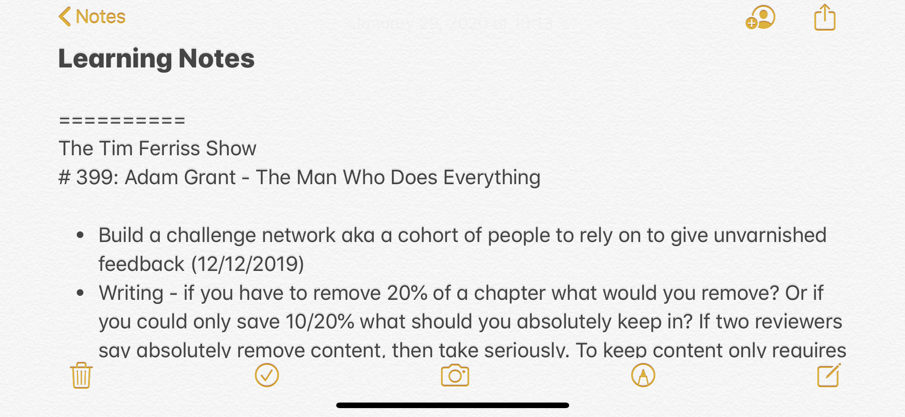

# Notes Digest Email

Compose and send an email containing a random selection of your learning notes and Kindle highlights.


You use the Notes application (the one provided by Apple) on your Mac or iOS device to update a "Learning Notes" note with interesting facts from podcasts, documentaries, TED talks, et cetera.

The program searches the Notes application for your note titled "Learning Notes" and downloads/formats entries for use in the notes digest email.



You send Kindle highlights from your Kindle device to your Gmail inbox.

The program searches your Gmail inbox for unread messages containing Kindle highlights and downloads/formats highlights for use in the notes digest email.


You run the program to send a one-time notes digest email from your Gmail account to a specified recipient. Or, you use the Calendar application (the one provided by Apple) on your Mac to send notes digest emails automatically.


## Getting Started


### Download the repository

Click `Clone or download` and `Download ZIP`. Once the download is complete, unzip the file and drag it onto your desktop.


### Install necessary packages

You need `Python 3.5` or greater along with the `pandas` and `jupyter` packages to successfully compose and send the notes digest email.


### *Optional: Set up a virtual environment with Anaconda*

You can create a virtual environment on your computer to hold the necessary Python version and packages. We can build the environment using the [Anaconda Distribution](https://www.anaconda.com/what-is-anaconda/), a popular Python data science platform for package management and deployment. If you already have Anaconda installed, proceed to the next step. Otherwise, [download the Python 3.7 version of Anaconda here](https://www.anaconda.com/download/).

To confirm Anaconda is installed correctly, [open a terminal window](http://blog.teamtreehouse.com/introduction-to-the-mac-os-x-command-line) and run:

`
conda --version
`

You should see the installed version number, such as `conda 4.8.0`. If you see an error message, reference [verifying that conda is installed](https://docs.anaconda.com/anaconda/install/verify-install/) in the conda documentation.

To list the virtual environments available on your computer, run:

`
conda info --env
`

You should see the active `base` environment identified with an asterisk (*) on this list. Verify that the `base` environment installed correctly using:

`
conda list
`

You should see a list of packages and package versions installed in your environment, including `jupyter`, `pandas`, and `python`. If you see an error message, reference [installing packages](https://docs.anaconda.com/anaconda/user-guide/tasks/install-packages/) in the conda documentation.


### Set Up Learning Notes

You'll use a note in the Notes application (the one provided by Apple) to collect interesting facts from podcasts, documentaries, TED talks, et cetera. You'll use iCloud to ensure you can record these interesting facts with any of your Apple devices.

#### iCloud for Notes

First, let's verify you have iCloud for Notes set up on your Mac and iOS devices.

1. On your Mac, go to `System Preferences`.
2. Click `iCloud`.
3. Check the box next to `Notes`.
4. On your iPhone or iPad, go to `Settings`.
5. Tap your name at the top.
6. Tap `iCloud`.
7. Toggle the switch next to `Notes` from gray to green.

Now when you open the Notes application on your Mac, you'll see all the notes from your iOS devices in the sidebar on the left-hand side of the window. If the notes from your iOS devices don't appear after a few minutes, [troubleshoot iCloud for Notes here](https://www.payetteforward.com/how-sync-iphone-notes-mac-pc-computer-fix/).

#### `Learning Notes` Note

Let's use the learning notes template included in the `notes-email-master` directory to create a `Learning Notes` note.

1. On your desktop, open the `notes-email-master` directory.
2. Open the `templates/learning_notes_template.txt` file.
3. Press `command + A` to highlight all the text.
4. Press `command + C` to copy the highlighted text.
5. On your Mac, open the Notes app (the one provided by Apple).
6. On the top menu bar, choose `File > New Note`.
7. Press `command + V` to paste the contents of the learning notes template into the new note.

Success! The new `Learning Notes` note will save automatically.

Now when you learn an interesting fact from a podcast, documentary, TED talk, et cetera, open this `Learning Notes` note on one of your Apple devices to record the fact for use in the notes digest email.

#### _A Quick Note on Formatting_

For the program to run correctly, you need to maintain the formatting of the `Learning Notes` note. Separate each podcast, documentary, TED talk, et cetera, with the `==========` barrier followed by the author and title. Mark each individual learning note with an asterisk (*). See [learning_notes_template.txt](./templates/learning_notes_template.txt) for example entries.

```
==========
Author 1
Title 1

* learning note (mm/dd/yyyy)
* learning note (mm/dd/yyyy)


==========
Author 2
Title 2

* learning note (mm/dd/yyyy)
* learning note (mm/dd/yyyy)
```

### Send Kindle Highlights

You'll use your internet-connected Kindle to send book highlights to your Gmail inbox.

First, let's verify your Kindle is connected to the internet.

1. On your Kindle, go to the `Home` screen.
2. Tap `Settings`.
3. Tap `All Settings`.
4. Tap `Wireless`.
5. Verify `Airplane Mode` is `Off`.
6. Tap `Wi-Fi Networks`.
7. Tap the network you want to use.
8. Enter the network password (if necessary).
9. Tap `Connect`.

Perfect!

Your Kindle sends book highlights to the email address associated with your Amazon account. Let's verify this email address is your Gmail account.

1. Go to your Amazon account. [Amazon account](https://www.amazon.com/gp/css/homepage.html)
2. Select `Login & Security`.
3. Confirm the `Email` is your Gmail account.
4. Click `Edit` to change the email to your Gmail account if necessary.
5. Click `Done`.

Success! Now you can send book highlights to your Gmail inbox.

Let's try it.

1. On your Kindle, tap on a book with highlights.
2. On the top menu bar, tap `...` in the upper-right corner.
3. Tap `Notes`.
4. Tap `Export Notes`.
5. Tap `Send`.

Now when you open your Gmail inbox, you'll see an email containing a CSV copy of the book's highlights.

Repeat this process for each of the books you want included in the notes digest email.

#### _A Quick Note on Formatting_

For the program to run correctly, each new email containing Kindle book highlights needs to be marked as unread in your Gmail inbox. After the program runs, you can mark these emails as read and archive/delete as you see fit. The program automatically saves a copy of each set of highlights in the `notes-digest-master/data/kindle` directory for use in future notes digest emails.

The emails containing book highlights can be archived/deleted after the program runs.

Once the program runs, these emails can be marked as read and archived/deleted. A copy of each book's highlights is stored in the `notes-digest-master/data/raw/archive` directory.

### Configure Gmail Authentication

The program accesses your Gmail inbox to retrieve Kindle highlights and to send the notes digest email. To allow this access, you'll need to turn on two-factor authentication for your Gmail account. You'll also need to create an app-specific Gmail password.

First, let's verify you have two-factor authentication on your Gmail account.

1. Go to your Google account. [Google account](https://myaccount.google.com/)
2. On the left navigation panel, click `Security`.
3. On the `Signing in to Google` panel, click `2-Step Verification` if necessary.
4. Click `Get Started`.
5. Follow the steps on the screen.

Perfect!

Now let's create an app-specific password--a 16-digit passcode that gives our non-Google program permission to access your Gmail account.

1. Go to your Google account. [Google account](https://myaccount.google.com/)
2. On the left navigation panel, choose `Security`.
3. On the `Signing in to Google` panel, choose `App Passwords`.
4. At the bottom, choose `Select app` and choose the `Mail` app.
5. Choose `Select device` and choose the `Mac` device you're using.
6. Choose `Generate`.
7. Highlight the 16-character code in the yellow bar (the app password) and press `command + C`.

Let's save this app password in a configuration file so our program can use it later.

1. On your desktop, open the `notes-email-master` directory.
2. Open the `templates/config_template.py` file.
3. Highlight `your_app_password` next to `GMAIL_PASSWORD`.
4. Press `command + V` to paste the app password as the new `GMAIL_PASSWORD`. Make sure you have ""around the app password.
5. Replace the `your_email@gmail.com` value next to `GMAIL_USER` with your Gmail account. Make sure you have ""around the email address.
6. On the top menu bar, choose `File > Duplicate`.
7. On the top menu bar, choose `File > Save`.
8. Save the duplicated file as `config.py` in the `notes-email-master` directory.
9. Once you've saved the app password, navigate back to your Google account and click `Done`.

Success!

#### Complete Configuration File

Let's circle back to the `config.py` file you saved in the previous step to fill out the remaining information.

1. On your desktop, open the `notes-email-master` directory.
2. Open the `config.py` file.
3. Replace the `specified_recipient_email@gmail.com` value next to `RECIPIENT_EMAIL` with the email address where you want to send the notes digest email (this can be your Gmail account). Make sure you have ""around the email address.
4. Replace the `5` value next to `NUM_NOTES` with the number of random learning notes and Kindle highlights to include in each notes digest email.
5. On the top menu bar, choose `File > Save`.

All set!

### __A Note on Directory Structure__

If you want to move the `notes-digest-master` directory from your desktop to another location, you'll need to update the file paths in two locations:

1. Line 2 of the `src/import_learning_notes.scpt` file.
2. Line 2 of the `notes_email` file.

## Run the Program

### Send a One-Time Notes Digest Email

You are now ready to send your first notes digest email!

1. On your desktop, open the `notes-email-master` directory.
2. Press `control + click` to right-click on the `notes_email.app` application.
3. Select `Open`.

Because you downloaded the notes email application from the internet, you need to confirm you want to open it.

1. Click `Open`.
2. Click `Open`.

The application temporarily opens a Terminal window while the program runs. Once the terminal window closes, navigate to the recipient email inbox and refresh to see your new notes digest email!

### Optional: Send Notes Digest Emails Automatically

You'll use the Calendar application (the one provided by Apple) on your Mac to send notes digest emails automatically.

#### iCloud for Calendars

First, let's verify you have iCloud for Calendars set up on your Mac and iOS devices.

1. On your Mac, go to `System Preferences`.
2. Click `iCloud`.
3. Check the box next to `Calendars`.
4. On your iPhone or iPad, go to `Settings`.
5. Tap your name at the top.
6. Tap `iCloud`.
7. Toggle the switch next to `Calendars` from gray to green.

Now when you open the Calendar application on your Mac, you'll see all the calendars from your iOS devices in the sidebar on the left-hand side of the window.

#### `Notes Email` Calendar

Let's create a new iCloud calendar to hold your scheduled notes digest email events.

1. On your Mac, open the Calendar app (the one provided by Apple).
2. Check the box next to the iCloud `Work` or `Home` calendar.
3. On the top menu bar, choose `File > New Calendar`.
4. Name the calendar `Notes Email`.
5. On the left navigation pane, check the box next to the iCloud `Notes Email` calendar. Uncheck all the other calendars.

Now let's create a repeated event to run the `send_notes.app` at a specified time. Your computer needs to be awake and running for each notes digest email to send successfully. Select the event time accordingly. If your computer is asleep or powered off during the scheduled event, `send_notes.app` runs the next time your computer is awake and running.

1. Double click on a date in the calendar to create a new event.
2. Name the event `Send Notes Digest Email`.
3. Click on the date and time.
4. Adjust the `starts` value to your desired date and time.
5. Change the `alert` value to `Custom...`.
6. Change the `Message with sound` value to `Open file`.
7. Change the `Calendar` value to `Other...`.
8. Select the `Desktop/notes-email-master/notes_email.app` file.
9. Change the `minutes before` value to `At time of event`.
10. Click `Ok`.
11. Adjust the `repeat` value to your desired interval specifying how often you want to receive the notes digest email.
12. Adjust the `end repeat` value to your desired value specifying when to stop the automation.

Done! Shortly after each scheduled event, you can navigate to the recipient email inbox to see a new notes digest email!


